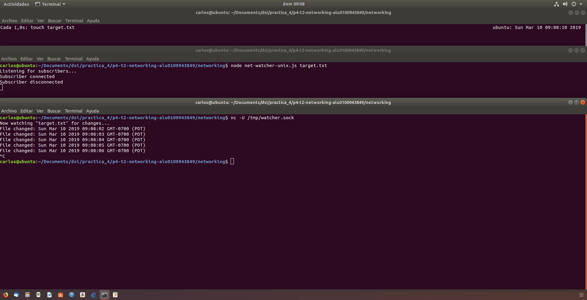

# Práctica 4 Networking with Sockets

## Escuchando por conexiones de sockets

Los servicios en red existen para hacer dos cosas: conectar dos puntos y transmitir información entre ellos. No importa qué tipo de información se transmita, primero se debe hacer la conexión.

### Enlazando un servidor a un puerto TCP

Las conexiones de socket TCP constan de dos endpoints, uno de ellos se enlaza a un puerto numerado mientras el otro se conecta a un puerto.

En Node.js son proporcionadas por el módulo net

	'use strict'
	const
	net = require('net'),
	server = net.createServer(connection => {
		// Use the connection object for data transfer.
	});
	server.listen(60300);

El metodo net.createServer toma un callback y retorna un objeto servidor. Node-js invoca el callback cuadno otro endpoint se conecta.

Llamando a server.listen nos permite unirnos al puerto especificado permitiendo que un número ilimitado de clientes se pueden conectar a ese puerto.

### Escribiendo datos en un Socket

Creamos un fichero que contenga lo siguiente:

	'use strict'
	const fs = require('fs');
	const net = require('net');
	const filename = process.argv[2];

	if(!filename){
		throw Error('Error: No filename specified.');
	}

	net.createServer(connection => {
		//Reporting
		console.log('Subscriber connected');
		connection.write(`Now watching "${filename}" for changes...\n`);

		//Watcher setup
		const watcher = fs.watch(filename, () => connection.write(`File changed: ${new Date()}\n`));

		//Cleanup
		connection.on('close',() => {
			console.log('Subscriber disconnected');
			watcher.close();
		});
	}).listen(60300,() => console.log('Listening for subscribers...'));

Al inspecionar el callback dado por la función createServer vemos que hace tres consas:
- Informa que la conexión se ha establecido (tanto para el cliente con connection.write y a la consola).
- Escucha al archivo por si se produjeron cambios. Este callback envía información de cambio al cliente usando connection.write.
- Escuha por el evento de cierre de conexión para reportar que el suscriptor se ha desconectado y dejar de observar el fichero con watcher.close.

### Conectándose a un servidor TCP con Netcat 

Para comporbar que todo funciona como queremos abrimos tres terminales.

En la primera introducimos

	$ ​​watch​​ ​​-n​​ ​​1​​ ​​touch​​ ​​target.txt​

para tocar el archivo en intervalos de un segundo

En la segunda corremos el programa

	$ node​​ ​​net-watcher.js​​ ​​target.txt​

En la tercera

	$ nc​​ ​​localhost​​ ​​60300​

para conectarnos al servicio de escucha del puerto TCP 60300 proporcionado por net-watcher.js

### Escuchando en Unix Sockets

Para ver como el modulo net usa los socket unix modificamos el programa net-watcher sustituyendo

	.listen(60300,() => console.log('Listening for subscribers...'));

por
 
	.listen('/tmp/watcher.sock', () => console.log('Listening for subscribers...'))

Realizamos los mismos pasos que el apartado anterior **Conectándose a un servidor TCP con Netcat**, pero esta vez ejecutaremos:

	$ nc -U /tmp/watcher.sock

Los sockets Unix pueden ser más rápidos que los sockets TCP porque no requieren invocar hardware de red. Sin embargo, por naturaleza están confinados a la máquina.

## Implementado un protocolo de mensajería

Un protocolo es un conjunto de reglas que define cómo se comunican los endpoints en un sistema. Nosotros crearemos un protocolo basado en pasar mensajes JSON a través de TCP.

Al implementaremos endpoints de cliente y servidor que utilizan nuestro nuevo protocolo basado en JSON nos dará la oportunidad de desarrollar casos de prueba y refactorizar nuestro código en módulos reutilizables.

### Serialización de mensajes con JSON

Vamos a desarrollar el protocolo de paso de mensajes que utiliza JSON para serializar los mensajes. Cada mensaje es un objeto serializado JSON, que es un hash de pares clave-valor. Aquí hay un ejemplo de objeto JSON con dos pares clave-valor:

	{​"key"​:​"value"​,​"anotherKey"​:​"anotherValue"​}

El servicio net-watcher que hemos estado desarrollando en este capítulo envía dos tipos de mensajes que necesitamos convertir a JSON:

- Cuando la conexión se establece por primera vez, el cliente recibe la cadena *Now watching "target.txt" for changes...*
- Cuando el archivo de destino cambia, el cliente recibe la cadena *File changed: Sun Mar 10 2019 09:08:02 GMT-0700 (PDT)*

Codificaremos el primer tipo de mensaje de esta manera:

	{​"type"​:​"watching"​,​"file"​:​"target.txt"​}

El campo de tipo indica que este es un mensaje de observación: el archivo especificado ahora se está viendo.

El segundo tipo de mensaje se codifica de esta manera:

	{​"type"​:​"changed"​,​"timestamp"​:1358175733785}

Aquí el campo type anuncia que el archivo de destino ha cambiado. El campo timestamp contiene un valor entero que representa el número de milisegundos

### Cambiando a mensajes JSON

