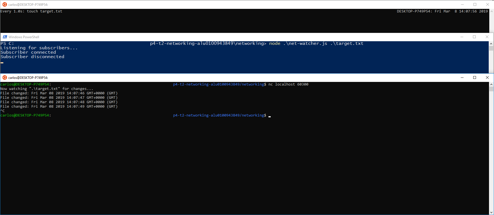

# Práctica 4 Networking with Sockets

## Escuchando por conexiones de sockets

Los servicios en red existen para hacer dos cosas: conectar dos puntos y transmitir información entre ellos. No importa qué tipo de información se transmita, primero se debe hacer la conexión.

### Enlazando un servidor a un puerto TCP

Las conexiones de socket TCP constan de dos endpoints, uno de ellos se enlaza a un puerto numerado mientras el otro se conecta a un puerto.

En Node.js son proporcionadas por el módulo net

	'use strict'
	const
	net = require('net'),
	server = net.createServer(connection => {
		// Use the connection object for data transfer.
	});
	server.listen(60300);

El metodo net.createServer toma un callback y retorna un objeto servidor. Node-js invoca el callback cuadno otro endpoint se conecta.

Llamando a server.listen nos permite unirnos al puerto especificado permitiendo que un número ilimitado de clientes se pueden conectar a ese puerto.

### Escribiendo datos en un Socket

Creamos un fichero que contenga lo siguiente:

	'use strict'
	const fs = require('fs');
	const net = require('net');
	const filename = process.argv[2];

	if(!filename){
		throw Error('Error: No filename specified.');
	}

	net.createServer(connection => {
		//Reporting
		console.log('Subscriber connected');
		connection.write(`Now watching "${filename}" for changes...\n`);

		//Watcher setup
		const watcher = fs.watch(filename, () => connection.write(`File changed: ${new Date()}\n`));

		//Cleanup
		connection.on('close',() => {
			console.log('Subscriber disconnected');
			watcher.close();
		});
	}).listen(60300,() => console.log('Listening for subscribers...'));

Al inspecionar el callback dado por la función createServer vemos que hace tres consas:
- Informa que la conexión se ha establecido (tanto para el cliente con connection.write y a la consola).
- Escucha al archivo por si se produjeron cambios. Este callback envía información de cambio al cliente usando connection.write.
- Escuha por el evento de cierre de conexión para reportar que el suscriptor se ha desconectado y dejar de observar el fichero con watcher.close.

### Conectándose a un servidor TCP con Netcat 

Para comporbar que todo funciona como queremos abrimos tres terminales.

En la primera introducimos

	$ ​​watch​​ ​​-n​​ ​​1​​ ​​touch​​ ​​target.txt​

para tocar el archivo en intervalos de un segundo

En la segunda corremos el programa

	$ node​​ ​​net-watcher.js​​ ​​target.txt​

En la tercera

	$ nc​​ ​​localhost​​ ​​60300​

para conectarnos al servicio de escucha del puerto TCP 60300 proporcionado por net-watcher.js

#### Escuchando en Unix Sockets

Para ver como el modulo net usa los socket unix modificamos el programa net-watcher sustituyendo
	.listen(60300,() => console.log('Listening for subscribers...'));
por 
	.listen('/tmp/watcher.sock', () => console.log('Listening for subscribers...'))

realizamos los mismos pasos que el apartado anterior **Conectándose a un servidor TCP con Netcat**, pero esta vez ejecutaremos:
	nc -U /tmp/watcher.sock

