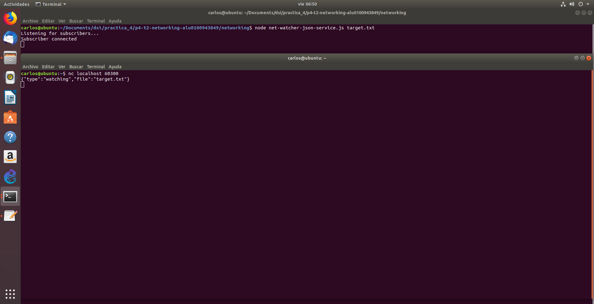
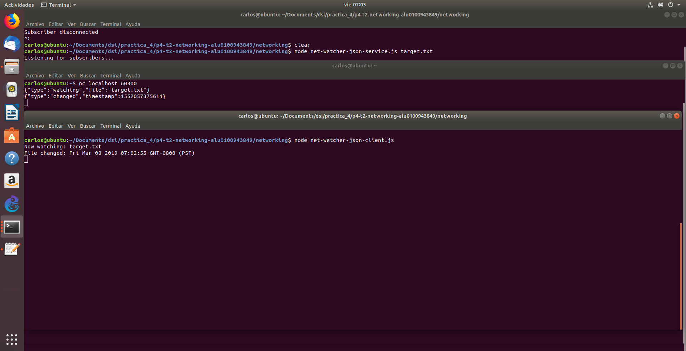
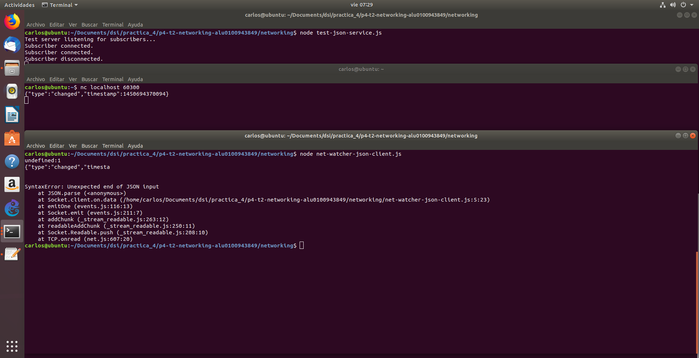
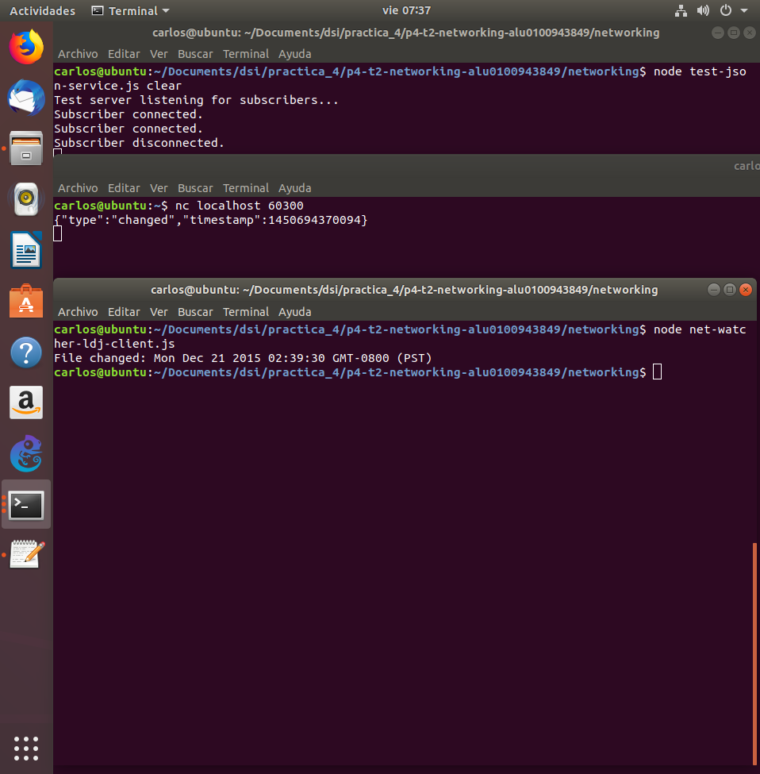
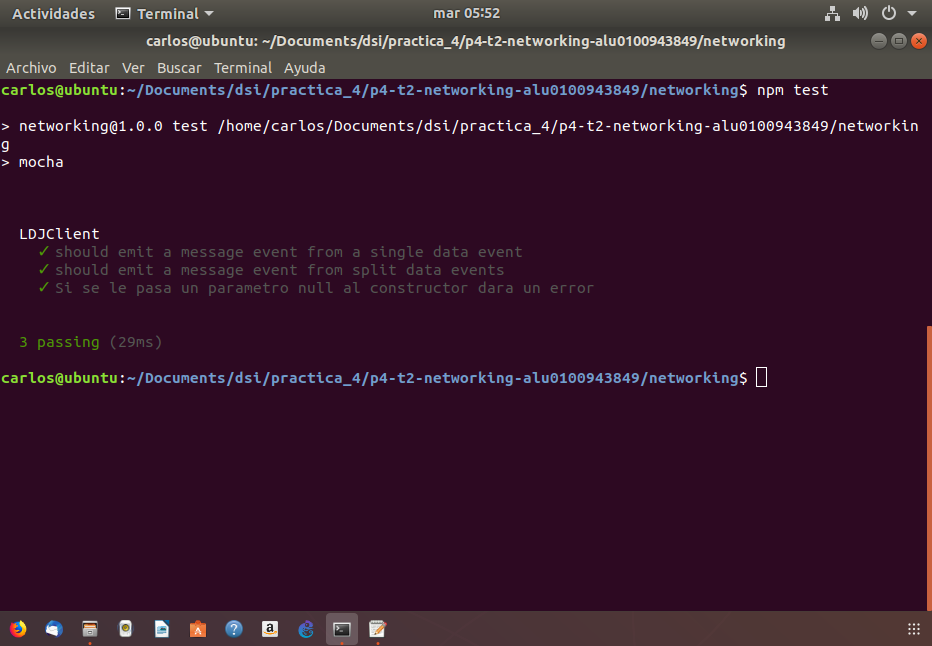

# Práctica 4 Networking with Sockets

## Escuchando por conexiones de sockets

Los servicios en red existen para hacer dos cosas: conectar dos puntos y transmitir información entre ellos. No importa qué tipo de información se transmita, primero se debe hacer la conexión.

### Enlazando un servidor a un puerto TCP

Las conexiones de socket TCP constan de dos endpoints, uno de ellos se enlaza a un puerto numerado mientras el otro se conecta a un puerto.

En Node.js son proporcionadas por el módulo net

	'use strict'
	const
	net = require('net'),
	server = net.createServer(connection => {
		// Use the connection object for data transfer.
	});
	server.listen(60300);

El metodo net.createServer toma un callback y retorna un objeto servidor. Node-js invoca el callback cuadno otro endpoint se conecta.

Llamando a server.listen nos permite unirnos al puerto especificado permitiendo que un número ilimitado de clientes se pueden conectar a ese puerto.

### Escribiendo datos en un Socket

Creamos un fichero que contenga lo siguiente:

	'use strict'
	const fs = require('fs');
	const net = require('net');
	const filename = process.argv[2];

	if(!filename){
		throw Error('Error: No filename specified.');
	}

	net.createServer(connection => {
		//Reporting
		console.log('Subscriber connected');
		connection.write(`Now watching "${filename}" for changes...\n`);

		//Watcher setup
		const watcher = fs.watch(filename, () => connection.write(`File changed: ${new Date()}\n`));

		//Cleanup
		connection.on('close',() => {
			console.log('Subscriber disconnected');
			watcher.close();
		});
	}).listen(60300,() => console.log('Listening for subscribers...'));

Al inspecionar el callback dado por la función createServer vemos que hace tres consas:
- Informa que la conexión se ha establecido (tanto para el cliente con connection.write y a la consola).
- Escucha al archivo por si se produjeron cambios. Este callback envía información de cambio al cliente usando connection.write.
- Escuha por el evento de cierre de conexión para reportar que el suscriptor se ha desconectado y dejar de observar el fichero con watcher.close.

### Conectándose a un servidor TCP con Netcat 

Para comporbar que todo funciona como queremos abrimos tres terminales.

En la primera introducimos

	$ ​​watch​​ ​​-n​​ ​​1​​ ​​touch​​ ​​target.txt​

para tocar el archivo en intervalos de un segundo

En la segunda corremos el programa

	$ node​​ ​​net-watcher.js​​ ​​target.txt​

En la tercera

	$ nc​​ ​​localhost​​ ​​60300​

para conectarnos al servicio de escucha del puerto TCP 60300 proporcionado por net-watcher.js

### Escuchando en Unix Sockets

Para ver como el modulo net usa los socket unix modificamos el programa net-watcher sustituyendo

	.listen(60300,() => console.log('Listening for subscribers...'));

por
 
	.listen('/tmp/watcher.sock', () => console.log('Listening for subscribers...'))

Realizamos los mismos pasos que el apartado anterior **Conectándose a un servidor TCP con Netcat**, pero esta vez ejecutaremos:

	$ nc -U /tmp/watcher.sock

Los sockets Unix pueden ser más rápidos que los sockets TCP porque no requieren invocar hardware de red. Sin embargo, por naturaleza están confinados a la máquina.

## Implementado un protocolo de mensajería

Un protocolo es un conjunto de reglas que define cómo se comunican los endpoints en un sistema. Nosotros crearemos un protocolo basado en pasar mensajes JSON a través de TCP.

Al implementaremos endpoints de cliente y servidor que utilizan nuestro nuevo protocolo basado en JSON nos dará la oportunidad de desarrollar casos de prueba y refactorizar nuestro código en módulos reutilizables.

### Serialización de mensajes con JSON

Vamos a desarrollar el protocolo de paso de mensajes que utiliza JSON para serializar los mensajes. Cada mensaje es un objeto serializado JSON, que es un hash de pares clave-valor. Aquí hay un ejemplo de objeto JSON con dos pares clave-valor:

	{​"key"​:​"value"​,​"anotherKey"​:​"anotherValue"​}

El servicio net-watcher que hemos estado desarrollando en este capítulo envía dos tipos de mensajes que necesitamos convertir a JSON:

- Cuando la conexión se establece por primera vez, el cliente recibe la cadena *Now watching "target.txt" for changes...*
- Cuando el archivo de destino cambia, el cliente recibe la cadena *File changed: Sun Mar 10 2019 09:08:02 GMT-0700 (PDT)*

Codificaremos el primer tipo de mensaje de esta manera:

	{​"type"​:​"watching"​,​"file"​:​"target.txt"​}

El campo de tipo indica que este es un mensaje de observación: el archivo especificado ahora se está viendo.

El segundo tipo de mensaje se codifica de esta manera:

	{​"type"​:​"changed"​,​"timestamp"​:1358175733785}

Aquí el campo type anuncia que el archivo de destino ha cambiado. El campo timestamp contiene un valor entero que representa el número de milisegundos

### Cambiando a mensajes JSON

Nuestra tarea es usar JSON.stringifypara codificar objetos de mensaje y enviarlos a través de connection.write. JSON.stringify toma un objeto de JavaScript y devuelve una cadena que contiene una representación serializada de ese objeto en forma JSON.

Ahora en el programa net-watcher.js sustituimos

	connection.write(​`Now watching "​${filename}​" for changes...\n`​);

por

	connection.write(JSON.stringify({type: ​'watching'​, file: filename}) + ​'​​\​​n'​);

y la llamada connection.write

	const watcher = fs.watch(filename, () => connection.write(`File changed: ${new Date()}\n`));

por

	const watcher = fs.watch(filename, () => connection.write(
		JSON.stringify({type: 'changed', timestamp: Date.now()}) + '\n'));

Guardamos el update como net-watcher-json-service.js y lo corremos

## Creando conexiones Socket para clientes

Ahora escribiremos un programa cliente en Node.js para recibir mensajes JSON de nuestro programa net-watcher-json-service.

Creamos un archivo llamado net-watcher-json-client.js y y le introducimos esto:

	'use strict';
	const net = require('net');
	const client = net.connect({port:60300});
	client.on('data', data => {
		const message = JSON.parse(data);
		if (message.type === 'watching') {
			console.log(`Now watching: ${message.file}`);
		} else if (message.type === 'changed') {
			const date = new Date(message.timestamp);
			console.log(`File changed: ${date}`);
		} else {
			console.log(`Unrecognized message type: ${message.type}`);
	
Este programa usa net.connect para crear una conexión con el puerto localhost 60300 y luego espera por datos.

Siempre que un evento de dato ocurre nuestra funcion callback coge el buffer entrante y analiza el mensaje JSON y lo muestra por consola.

Para ejecutar el programa primero ejecutamos el net-watcher-json-service.js y en otra terminal ejecutamos

	$ ​​node​​ ​​net-watcher-json-client.js​

## Probando la funcionalidad de la aplicación de red

Las pruebas funcionales nos aseguran que nuestro código hace lo que esperamos que haga. En esta sección, desarrollaremos una prueba para nuestros programas de cliente y servidor de observación de archivos en red. Crearemos un servidor simulado que se ajuste a nuestro protocolo LDJ al tiempo que exponemos fallas en el cliente.

### Entendiendo el problema del límite del mensaje

Cuando desarrollas programas en red en Node.js, a menudo se comunicarán pasando mensajes. En el mejor de los casos, un mensaje llegará a la vez. Pero a veces los mensajes llegarán en pedazos.

El protocolo LDJ separa los mensajes con caracteres de salto de línea. Cada carácter de salto de línea es el límite entre dos mensajes.

​	{"type":"watching","file":"target.txt"}\n
​	{"type":"changed","timestamp":1450694370094}\n
​	{"type":"changed","timestamp":1450694375099}\n

Nuestro programa de cliente actualmente se basa en este comportamiento. Analiza cada mensaje enviando el contenido del búfer de datos directamente a JSON.parse:

	client.on('data', data => {
		const message = JSON.parse(data);

### Implementando un servicio de prueba

Escribir aplicaciones robustas de Node.js significa manejar sin problemas problemas de red como entradas divididas, conexiones rotas y datos erróneos. Ahora implementaremos un servicio de prueba que divide a propósito un mensaje en varias partes.

Creamos un fichero que se llame test-json-service.js y dentro ponemos:

	'use strict';
	const server = require('net').createServer(connection => {
		console.log('Subscriber connected.');

		//Two message chunks that together make a whole message.
		const firstChunk = '{"type":"changed","timesta';
		const secondChunk = 'mp":1450694370094}\n';

		//Send the first chunk inmediately.
		connection.write(firstChunk);

		//After a short delay, send the other chunk.
		const timer = setTimeout(() => {
			connection.write(secondChunk);
			connection.end();
		}, 100);

		//Clear timer when the connection ends.
		connection.on('end', () => {
			clearTimeout(timer);
			console.log('Subscriber disconnected.');
		});
	});

	server.listen(60300, function() {
		console.log('Test server listening for subscribers...');
	});

y lo ejecutamos con:
	
	$ ​​node​​ ​​test-json-service.js

Este servicio de prueba difiere de nuestro net-watcher-json-service.js de algunas maneras. En lugar de configurar un observador del sistema de archivos solo enviamos el primer fragmento predeterminado de inmediato, luego configuramos un temporizador para enviar el segundo fragmento después de un breve retraso.

La función de JavaScript setTimeout toma dos parámetros: una función para invocar y una cantidad de tiempo en milisegundos. Después de la cantidad de tiempo especificada, la función será llamada. Finalmente usamos clearTimeout.para anular la devolución de llamada.

El error inesperado token nos dice que el mensaje no era un JSON completo y válido. Nuestro cliente intentó enviar la mitad de un mensaje a JSON.parse, que solo espera cadenas JSON completas y con el formato correcto como entrada.

## Extendiendo Clases del Núcleo en Módulos Customizables

El programa Node.js que hicimos en la última apartado **Probando la funcionalidad de la aplicación de red** expuso una falla en nuestro código de cliente; Es decir, que no termina sus entradas. Cualquier mensaje que llegue como múltiples eventos de datos lo bloqueará.

Así que realmente el programa cliente tiene dos tareas que hacer. Una es almacenar los datos entrantes en mensajes. La otra es manejar cada mensaje cuando llega.

En lugar de agrupar estos dos trabajos en un solo programa Node.js, lo correcto es convertir al menos uno de ellos en un módulo Node.js.

### Extendiendo EventEmitter

Para liberar al programa cliente del peligro de separar mensajes JSON, implementaremos un módulo cliente LDJ.

### Herencia en Node

Primero echemos un vistazo a cómo Node.js hace la herencia. El siguiente código configura LDJClient para heredar de EventEmitter.

	const​ EventEmitter = require(​'events'​).EventEmitter;
​	​class​ LDJClient ​extends​ EventEmitter {
​		​constructor​(stream) {
​			​super​();
​		}
​	}

Dentro del constructor llamamos a super() para invocar al propio constructor de EventEmitter. Siempre que esté implementando una clase que extienda de otra clase, debe comenzar por llamar super, con los argumentos de constructor apropiados para ello.

### Eventos de datos de buffering

Ahora vamos a usar el parametro stream para recuperar y enviar la entrada. El objetivo es tomar los datos de entrada en bruto del stream y convertirlo en un mensaje.

El siguiente constructor actualizado. Anexa fragmentos de datos entrantes a una cadena de búfer en ejecución y explora los finales de línea.

​	constructor​(stream) {
​		​super​();
​		let​ buffer = ​''​;
​		stream.on(​'data'​, data => {
​			buffer += data;
​			let​ boundary = buffer.indexOf(​'​​\​​n'​);
​			​while​ (boundary !== -1) {
​				​const​ input = buffer.substring(0, boundary);
​				buffer = buffer.substring(boundary + 1);
​				this​.emit(​'message'​, JSON.parse(input));
​				boundary = buffer.indexOf(​'​​\​​n'​);
​			}
​		});
​	}

Comenzamos llamando a super , como antes, y luego configuramos una variable de cadena llamada buffer para capturar los datos entrantes. A continuación, usamos stream.on para manejar eventos de datos.

Agregamos datos sin procesar al final del búfer y luego buscamos los mensajes completos desde el frente. Cada cadena de mensaje se envía a través de JSON.parse y, finalmente, es emitida por el LDJClient como un evento de mensaje a través de this.emit.

### Exportando Funcionalidad en un Módulo

Creamos un directorio llamado lib y en el creamos el archivo ldj-client.js e insertamos en el

	'use strict';
	const EventEmitter = require('events').EventEmitter;
	class LDJClient extends EventEmitter {
		constructor(stream) {
			super();
			let buffer = '';
			stream.on('data', data => {
				buffer += data;
				let boundary = buffer.indexOf('\n');
				while (boundary !== -1) {
					const input = buffer.substring(0, boundary);
					buffer = buffer.substring(boundary + 1);
					this.emit('message', JSON.parse(input));
					boundary = buffer.indexOf('\n');
				}
			});
		}

		static connect(stream) {
			return new LDJClient(stream);
		}
	}

	module.exports = LDJClient;

### Importando un Módulo Node.js personalizado

Es hora de hacer uso de nuestro módulo personalizado. Modifiquemos el cliente para usarlo en lugar de leer directamente desde la secuencia TCP.

creamos un archivo net-watcher-ldj-client.js e introducimos

	'use strict';
	const netClient = require('net').connect({port: 60300});
	const ldjClient = require('./lib/ldj-client.js').connect(netClient);

	ldjClient.on('message', message => {
		if (message.type === 'watching') {
			console.log(`Now watching: ${message.file}`);
		} else if (message.type === 'changed') {
			console.log(`File changed: ${new Date(message.timestamp)}`);
		} else {
			throw Error(`Unrecognized message type: ${message.type}`);
		}
	});

este programa se basa en el módulo ldj-client para producir eventos de mensajes.

Para asegurarse de que resuelve el problema del mensaje dividido, ejecutemos el servicio de prueba:

	$ ​​node​​ ​​test-json-service.js

Y en una terminal diferente

	$ ​​node​​ ​​net-watcher-ldj-client.js

## Desarrollando Pruebas Unitarias con Mocha

Mocha es un popular frame de prueba multiparadigma para Node.js. Cuenta con varios estilos diferentes para describir sus pruebas. Nosotros usaremos el estilo de desarrollo impulsado por el comportamiento (BDD).

### instalación de mocha mediante npm

Para la instalación de mocha hay que usar el archivo *package.json* para establecer las dependencias de desarrollo, para ello ejecutamos en nuestra terminal

	$ npm init -y

que nos creará el archvio predeterminado, ahora instalaremos mocha ejecutando

	$ npm install ​​--save-dev​​ ​​--save-exact​​ ​​mocha@3.4.2​

Cuando el comando termine en el archivo *package.json* encontraremos 

	"devDependencies": {
		"mocha": "3.4.2"	
	}

## Escribiendo pruebas unitarias con mocha

Para crear la prueba unitaria crearemos un archivo llamado *ldj-client-test.js* en una carpeta llamada test, esta carpeta se crea por convenio. Editamos el archivo añadiendo:

	'use strict';
	const assert = require('assert');
	const EventEmitter = require('events').EventEmitter;
	const LDJClient = require('../lib/ldj-client.js');

	describe('LDJClient', () => {
		let stream = null;
		let client = null;

		beforeEach(() => {
			stream = new EventEmitter();
			client = new LDJClient(stream);
		});

		it('should emit a message event from a single data event', done => {
			client.on('message', message => {
				assert.deepEqual(message, {foo: 'bar'});
				done();
			});
			stream.emit('data', '{"foo":"bar"}\n');
		});
	});

Para crear el contexto de la prueba se utiliza el método *describe* con el nombre de la prueba. Despues creamos deo variables *let* ina para isntanciar LDJClient y la otra para el EventEmitter y en *beforeEach* asignamos una nueva instancia a cada variable y finalmente se llama al *if* para comprobar el comportamiento de la clase.

## Ejecutando pruebas unitarias de mocha con npm

Para ejecutar mocha usando npm primero tenemos que añadir el la seccion *script* del package.json mocha, añadimos:

	"scripts": {
		"test": "mocha"
	},

Los script son comandos que se invocan desde la linea de comandos usando *npm run* en nuestro caso *npm run test*.

## Travis

